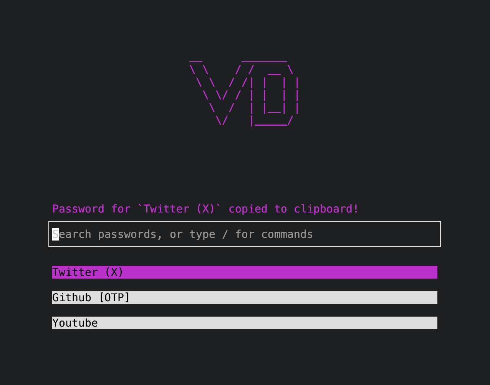
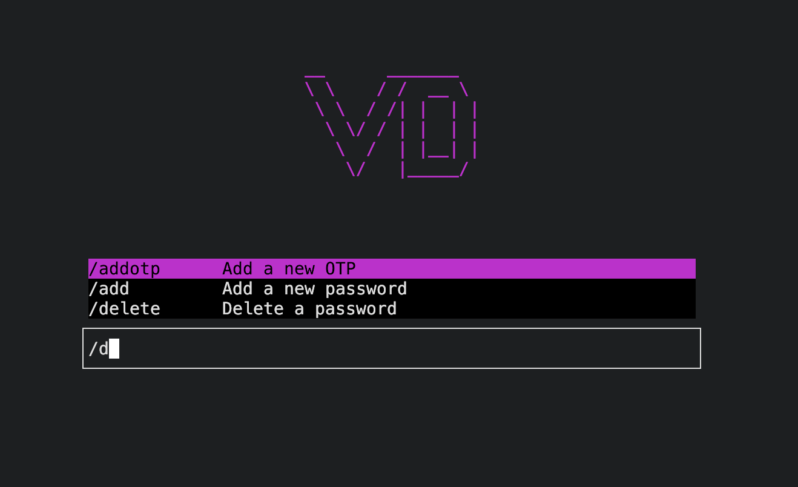

# vd
`vd` is TUI password manager and OTP authenticator for Unix systems (Linux and MacOS).





## Features
- Encrypting the credentials using [GPG](https://www.gnupg.org/).
- 2FA/OTP Authentication, you can finally get your OTP codes from your computer without reaching your phone.
- Import your existing OTP secrets from Google Authenticator.
- Scriptability with cli arguments (see [Usage](#usage)).
- Built-in random password generator.
- Export credentials to csv.

## Installation
For Linux, MacOS you can download a binary release here.

## Build from source:

```bash
git clone https://github.com/ahmedhosssam/vd.git
cd vd
go mod tidy
go build main.go
mkdir -p ~/.local/bin && mv main ~/.local/bin/vd
```

## Usage

You can open the TUI by:
```bash
vd
```

Or use it from the cli:
```bash
Commands:
  add      Add a new password [--name password_name --password password]
  get      Copy a password to clipboard
  delete   Delete a stored password [-f|--force]
  change   Change a stored password
  otp      Add an OTP or copy its code [add|get otp_name]
  register Register a new GPG key
  ls       List stored passwords
  gen      Generate a random password to clipboard
  export   Export passwords to a CSV file in the home directory [password_name]
  import   Import OTP secrets from a Google Authenticator export QR image [otp google path/to/img.jpg]
```

## How Does vd Work?

`vd` relies on `gpg` keys for encryption, so we don't implement any encryption algorithms ourselves, we use GPG for encrypting/decrypting the credentials on the disk.
`vd` creates its own `gpg` key by default when you first register by `$ vd register` or through the TUI by `/register`. But if you want to use your already existing gpg key for encryption, you can just type the email that's registered for your key in `~/.local/share/vd/gpg_email.txt`.

**NOTE:** Once the credentials is encrypted with a specifc GPG key, it will be decrypted **only** with the same key, even if you changed `~/.local/share/vd/gpg_email.txt`. That's how GPG works.
